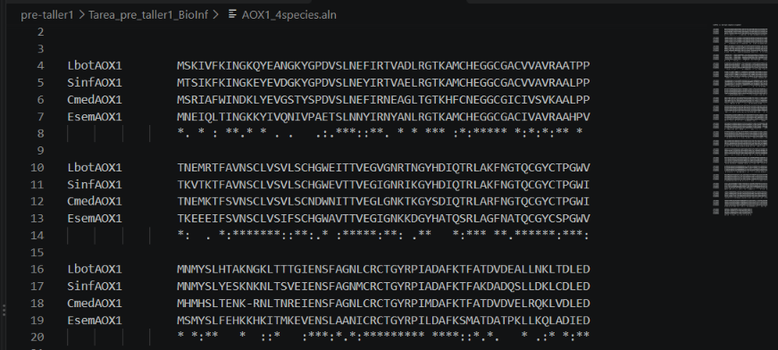

## Pregunta 1: Alineamiento múltiple de secuencias AOX1 y regiones conservadas

Se realizó el alineamiento múltiple de las secuencias de aminoácidos de AOX1 para las cuatro especies (L. botrana, S. inferens, C. medinalis y E. semiherbida) utilizando ClustalW.

### Resultados y Análisis:

* Región 1 (10 aa - Bloque 3):** `CRCTGYRPIA` — Presenta 10 asteriscos seguidos (`**********`), constituyendo el tramo de conservación exacta más largo visible en la imagen.
* Región 2 (Motivo de 7 aa - Bloque 2):** `VNSCLVS` — Presenta 7 asteriscos seguidos (`*******`), 100% idéntico en las cuatro secuencias.
* Región 3 (Motivo de 6 aa - Bloque 2):** `TQCGYC` — Presenta 6 asteriscos seguidos (`******`).
* Región 4 (Motivo de 5 aa - Bloque 2):** `TTVEN` — Presenta 5 asteriscos seguidos (`*****`).
* Región 5 (Motivo de 4 aa - Bloque 3):** `DAFK` — Presenta 4 asteriscos seguidos (`****`), ubicado inmediatamente a continuación de la región de 10 aa.

**Conclusión:** La presencia de estas regiones altamente conservadas (en especial el dominio `CRCTGYRPIA` de 10 aminoácidos) sugiere que corresponden a sitios catalíticos y estructurales esenciales para la función enzimática de la aldehído oxidasa (AOX1) en estas cuatro especies de insectos.

## Pregunta 2: Análisis filogenético del set completo e identificación del clado más distante

Se construyó el árbol filogenético circular utilizando el método de Neighbor-Joining (NJ) a partir del alineamiento múltiple de todas las isoformas de la enzima aldehído oxidasa (AOX) y secuencias homólogas de referencia.

### Resultados y Discusión:

1. **Clado más Distante / Outgroup (Destacado en ROJO):** 
   El clado resaltado en rojo (correspondiente a las secuencias de *Plutella xylostella* / `Px007928`) constituye la rama evolutivamente más distante y basal del árbol. Su extensa longitud de rama confirma que actúa como el grupo externo (*outgroup*) respecto a todo el conjunto de enzimas analizado.

2. **Clado Intermedio (Destacado en VERDE/AMARILLO): 
   A continuación del grupo externo rojo, se ramifica un clado en verde/amarillo compuesto principalmente por secuencias de Xantina Deshidrogenasa (`XDH`) junto a isoformas divergentes de AOX. Este grupo refleja una etapa evolutiva intermedia en la divergencia de la superfamilia de molibdoenzimas.

3. **Clado Principal de AOX (Destacado en AZUL):** 
   El clado resaltado en **azul** reúne a las isoformas principales de AOX (`AOX1`, `AOX2`, `AOX3`), formando un monofilético fuertemente separado y genéticamente distante del clado basal rojo. Esto demuestra una clara separación funcional y evolutiva entre las isoformas canónicas de AOX y las secuencias basales/XDH.

## Pregunta 3: Herramientas bioinformáticas utilizadas y su aplicación

A lo largo del taller se emplearon diversas herramientas computacionales y bioinformáticas especializadas para el procesamiento de secuencias, alineamiento, construcción filogenética y documentación:

* **Ubuntu / Terminal de Linux (WSL) & Python 3:**
  * Uso: Automatización y manipulación de archivos FASTA. Se utilizó para filtrar secuencias específicas (extracción de las 4 isoformas de `AOX1`) y consolidar múltiples archivos de secuencias (`.txt`) en datasets unificados (`AOX1_4species.fasta` y `AOX_todas_especies.fasta`).

* **ClustalW (v2.1):**
  * Uso: Alineamiento múltiple de secuencias de aminoácidos (MSA) y cálculo de matrices de distancia. Se utilizó para identificar las regiones y motivos altamente conservados entre las proteínas AOX1, así como para generar los archivos de dendrograma/árbol (`.dnd`) mediante el algoritmo de *Neighbor-Joining* (NJ).

* **FigTree (v1.4.4):**
  * Uso: Visualización, edición gráfica y análisis del árbol filogenético. Se utilizó para renderizar la topología circular del árbol, ajustar la escala tipográfica y aplicar códigos de colores por clados (rojo para el grupo externo basal, verde/amarillo para el clado intermedio XDH, y azul para el clado principal de isoformas AOX).

* **Visual Studio Code (VS Code) & Markdown:**
  * Uso: Entorno de desarrollo integrado (IDE) para la edición de texto plano y formateo del reporte final (`README.md`), permitiendo vincular e integrar las capturas de pantalla de los alineamientos y árboles exportados.

* **Git & GitHub:**
  * Uso: Control de versiones y publicación en repositorio remoto público para la entrega y revisión del taller.